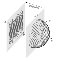

<a id='HEALPix-Numerical-Grid'></a>

<a id='HEALPix-Numerical-Grid-1'></a>

# HEALPix Numerical Grid


HEALPix, Hierarchical Equal Area iso-Latitude Pixelization [(Hardin et al., 2016)](https://doi.org/10.48550/arXiv.1607.04590), was developed by NASA to have three distinct properties, which are that


  * the sphere is hierarchically tessellated into curvilinear quadrilaterals,
  * the pixelization is an equal area partition of $\mathbb{S}^2$, and
  * the point sets are distributed along fixed lines of latitude.


The generation of such points firstly requires a division of the sphere into twelve equal area, four sided pixels defined by:


$$
\begin{aligned}
    |\cos\phi|>\frac{2}{3}, \qquad \theta=m\frac{\pi}{2}, \qquad & \quad m = 0,1,2,3 \\
    \cos\phi = \frac{-2-4m}{3} + \frac{8\theta}{3\pi}, \qquad \frac{m\pi}{2} \leq \theta \leq \frac{(m+1)\pi}{2}, \qquad & \quad m=0,1,2,3 \\
    \cos\phi=\frac{2-4m}{3}-\frac{8\theta}{3\pi}, \qquad \frac{-(m+1)\pi}{2} \leq \theta \leq \frac{-m\pi}{2}, \qquad & \quad  m=0,1,2,3.
\end{aligned}
$$


These pixels can be further partitioned into a $k \times k$ grid of sub-pixels of the same shape and area. The points of the set are located in the centers of each pixel. The subdivision leads to $k$ iso-latitudinal rings at the polar region $|\cos\phi|>2/3$, with


$$
    |\cos\phi_i|=1-\frac{i^2}{3k^2}, \qquad \theta_j=\frac{\pi}{2i} \left( j - \frac{1}{2} \right),
$$


thus, every $i$-th ring has $4i$ equally spaced points. Closer to the equatorial region, $2k-1$ iso-latitudinal rings with $4k$ points each emerge. These points are indexed by $k \leq |i| \leq 2k$ and $1 \leq j \leq 4k$:


$$
    |\cos\phi_i| = \frac{4}{3} - \frac{2i}{3k}, \qquad \theta_j = \frac{\pi}{2k} \left( j - \frac{s}{2} \right), \qquad s = (i-k+1) \mod 2.
$$


The last index, $s$, describes the phase shift between the rings. Finally, this configuration produces a set of $N=12k^2$ points [(Hardin et al., 2016)](https://doi.org/10.48550/arXiv.1607.04590).


<a id='Manual'></a>

<a id='Manual-1'></a>

## Manual


```julia
# load and use ExESS package
include(joinpath(PathToPackage, "src", "ExESS.jl"))
using .ExESS

# define grid input
R = 1_000_000 # sphere radius [m]
k = 12 # N = 12*k^2 total number of grid points [-]

# create structured grid
grid = HEALPix_2D_sGrid(R, k)
```


<a id='Examples'></a>

<a id='Examples-1'></a>

## Examples


|                                                                                                                                                                                      |
|:--------------------------------------------------------------------------------------------------------------------------------------------------------------------------------------------------------- |
| **Figure 1: HEALPix based grid**. Spherical HEALPix based grid, displayed on half a sphere. *Right*, in cartesian coordinates, *left* projected onto two dimensions and displayed in angular coordinates. |


<a id='API'></a>

<a id='API-1'></a>

## API


!!! warning "Missing docstring."
    Missing docstring for `HEALPix_2D_sGrid`. Check Documenter's build log for details.


